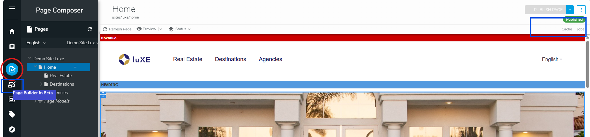

# Lux & MariaDB with activation of Page Composer
This case will activate Page Composer.
The idea is to let editors have the right to manage Page Caches as they used to.

Associated Article [Enabling or disabling Page Composer & Page Builder](https://academy.jahia.com/documentation/jahia-cms/jahia-8/system-administrator/administering-your-server/enabling-or-disabling-page-composer-page-builder)



```
docker-compose up --renew-anon-volumes
```